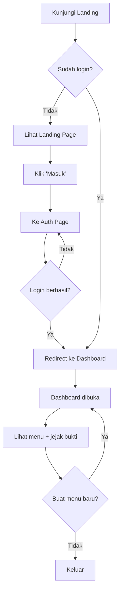
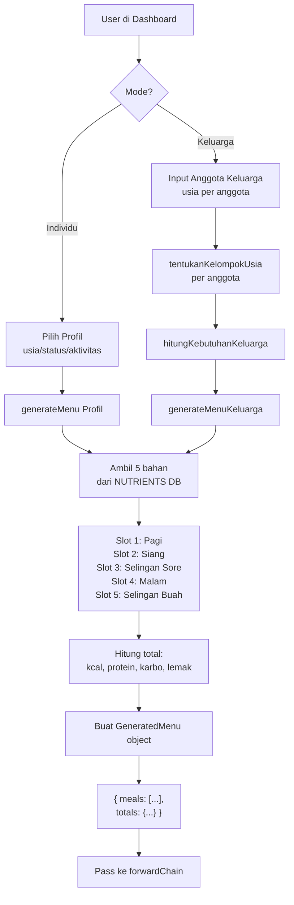
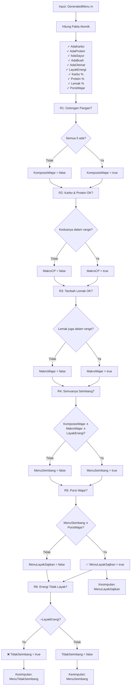
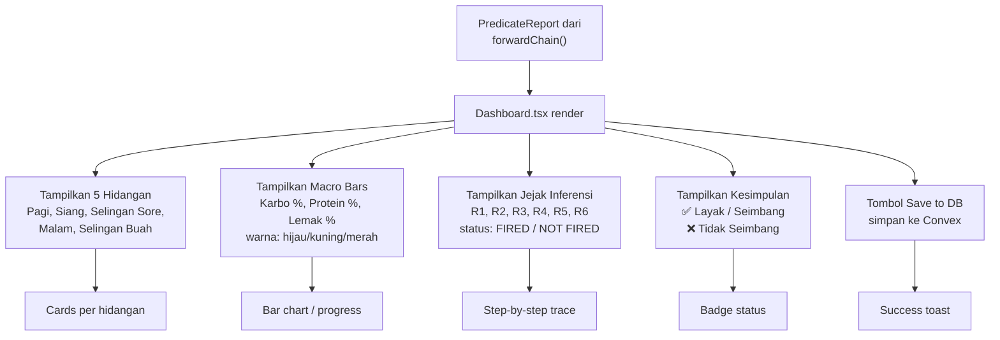
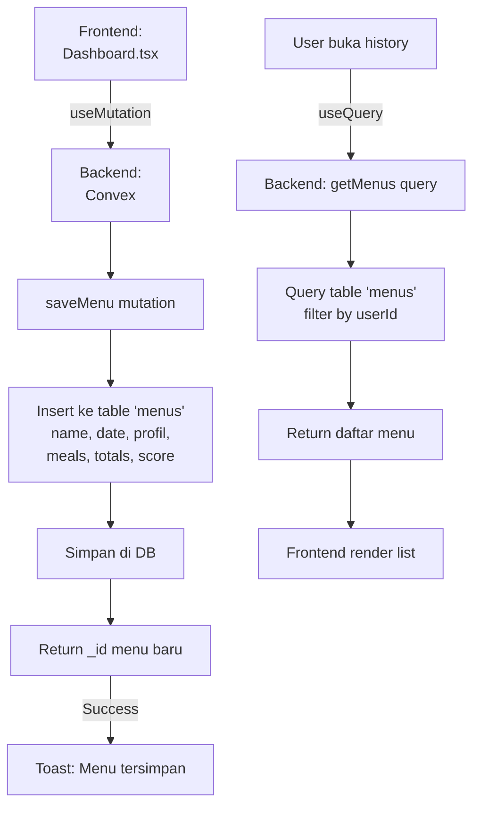
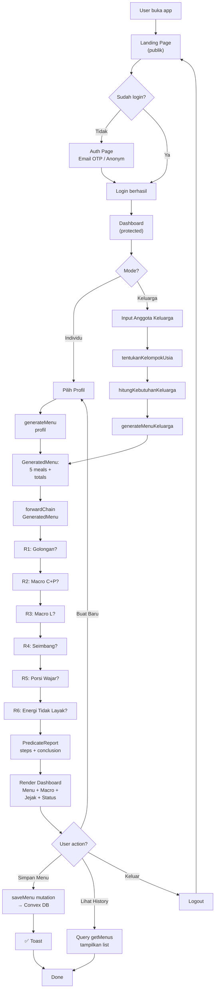

# Flowchart Sistem Menu Giziku

## 1. User Journey (Navigasi)

---

## 2. Menu Generation Flow (Generate Menu Harian & Keluarga)

---

## 3. Forward Chaining Evaluation (Predicate Logic)

---

## 4. Dashboard Display (UI Result)

---

## 5. Backend & Database Flow

---

## 6. Alur Lengkap End-to-End

---

## 7. Legend

| Simbol   | Arti                |
| -------- | ------------------- |
| `→`      | Alur proses         |
| `{...}`  | Keputusan / kondisi |
| `✓`      | Berhasil / true     |
| `❌`     | Gagal / false       |
| `R1-R6`  | 6 aturan inferensi  |
| `Convex` | Backend database    |

---

Buka file ini dengan extension Mermaid di VS Code untuk melihat diagram visual secara langsung. 🎨
